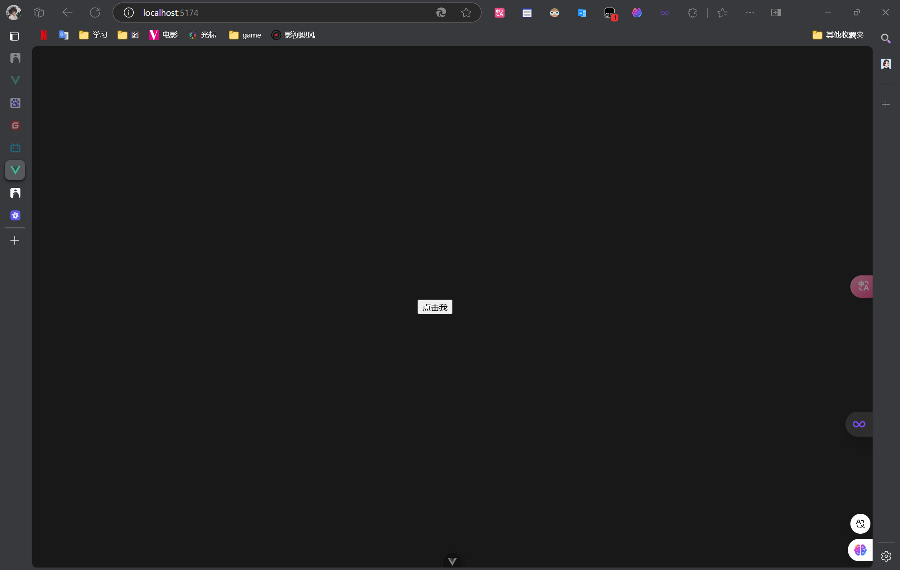
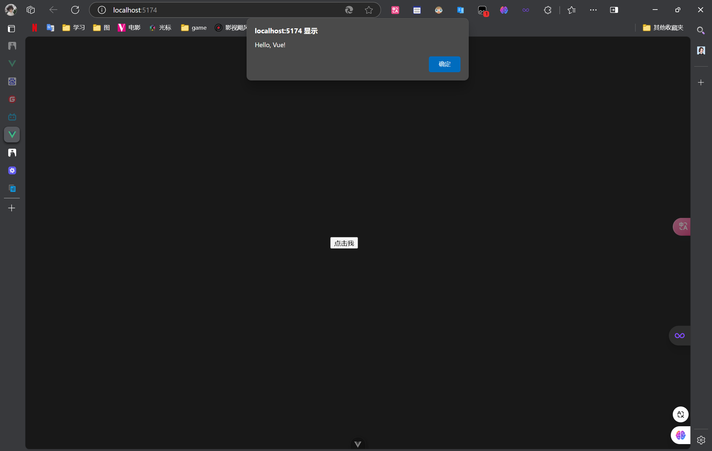
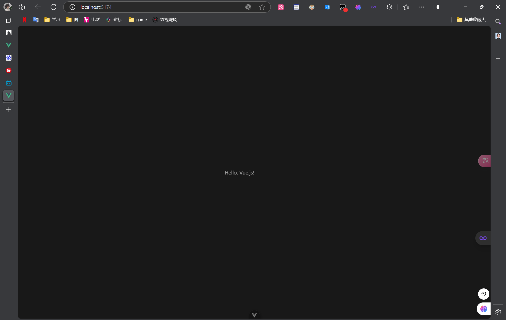
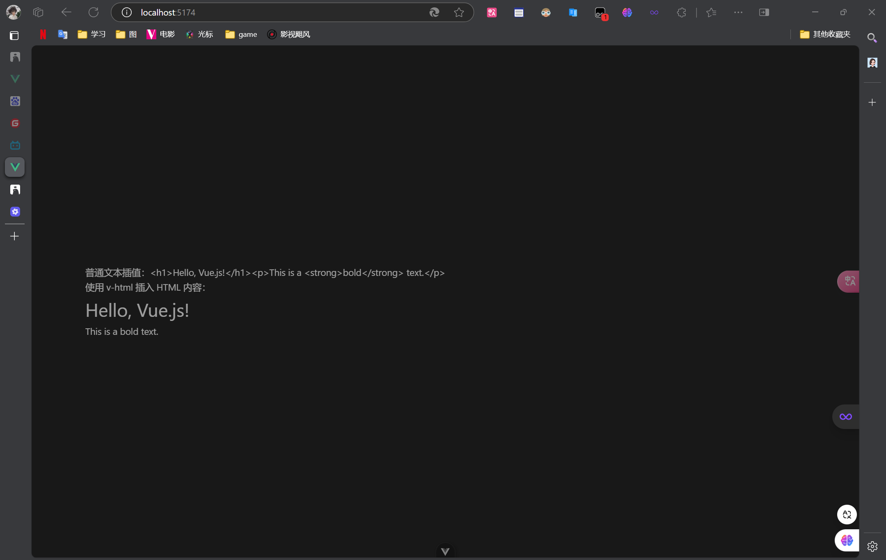

<!--
 * @Description: 
 * @Author: FallCicada
 * @Date: 2024-11-12 16:59:29
 * @LastEditors: FallCicada
 * @LastEditTime: 2024-11-12 19:23:07
 * @: 無限進步
-->
# 姓名：张煜
# 学号：2208300002
### 1. Vue.js 是什么？简述 Vue.js 的定义及其主要特点。
#### 答：
Vue.js 是一个用于构建用户界面的***渐进式*** JavaScript 框架。它的核心库专注于视图层，并且非常容易上手，同时也可以与现代工具链以及各种支持库结合使用。主要特点包括：

- **响应式数据绑定**：通过双向数据绑定实现数据和视图的同步更新。
- **组件化开发**：支持将应用程序拆分为可复用的组件，提高开发效率和代码维护性。
- **虚拟 DOM**：通过虚拟 DOM 提高性能，减少直接操作真实 DOM 带来的性能开销。
- **易于集成**：可以与现有项目轻松集成，也可以用于单页面应用程序（SPA）的开发。
- **丰富的生态系统**：拥有丰富的插件和工具支持，如 Vue Router、Vuex 等。

### 2. 什么是响应式数据？解释 Vue.js 中响应式数据的概念，以及它是如何工作的。
#### 答：
响应式数据是指当数据发生变化时，视图会自动更新以反映这些变化。Vue.js 通过使用观察者模式实现响应式数据绑定。具体来说，当数据对象被初始化时，Vue.js 会遍历该对象的属性，并使用 `Object.defineProperty` 将这些属性转换为 getter 和 setter，从而在属性被访问或修改时进行依赖收集和派发更新。

当数据发生变化时，依赖于这些数据的所有组件都会被重新渲染，从而确保视图与数据保持同步。不需要手动更新 DOM

### 3. v-if 和 v-show 有什么区别？比较并解释 v-if 和 v-show 指令在 Vue.js 中的使用场景和性能差异。
#### 答：
`v-if` 和 `v-show` 都是用于条件渲染的指令，但它们在实现逻辑和使用场景上有所不同：

- **`v-if`**：条件渲染指令，只有在条件为真时才会渲染元素。元素及其绑定的事件和子组件在条件为假时会被销毁。适用于在运行时需要频繁切换的场景，如果反复增删的资源较大时，性能开销较大。
- **`v-show`**：条件展示指令，元素始终会被渲染并保留在 DOM 中，只是通过 CSS 的 `display` 属性来控制显示与隐藏。适用于需要频繁切换显示状态的场景，因为它不会销毁和重建元素，而是隐藏资源，性能开销较小。

### 4. 描述在 Vue.js 中绑定事件处理器的方法，并给出一个简单的示例。

#### 答：

在 Vue.js 中，可以使用 `v-on` 指令（或简写 `@`）来绑定事件处理器。`v-on` 指令用于监听 DOM 事件，并在事件触发时执行指定的方法。

```html
<template>
  <button v-on:click="greet('Hello, Vue!')">点击我</button>
</template>

<script>
export default {
  methods: {
    greet(message) {
      alert(message);
    }
  }
}
</script>
```
##### 运行结果
###### 按钮点击前

###### 按钮点击后


### 5. 什么是计算属性（computed properties）？解释计算属性的作用，并说明它与方法的区别。
#### 答：
计算属性是 Vue.js 中的一种特殊属性，用于基于现有数据计算出新的数据。它们的主要作用是简化模板中的复杂逻辑，并提高代码的可读性和维护性。

计算属性与方法的区别在于：
- **缓存**：计算属性是基于它们的依赖进行缓存的，只有当依赖的数据发生变化时，才会重新计算。这意味着如果多次访问计算属性，只要依赖没有变化，计算属性会立即返回之前的计算结果，而不会重新执行计算逻辑。
- **调用方式**：计算属性在模板中像属性一样使用，而方法需要在模板中以函数调用的方式使用。

### 6. 什么是 Vue Router？简述 Vue Router 的作用及其在 Vue.js 单页面应用（SPA）中的实现原理。
#### 答：
Vue Router 是 Vue.js 官方的路由管理器，用于构建单页面应用（SPA）。它允许开发者通过不同的 URL 映射到不同的组件，从而实现页面的导航和组件的切换。

主要作用包括：
- **URL 映射**：将不同的 URL 映射到不同的组件或视图。
- **导航守卫**：在路由切换前后执行特定的逻辑，如权限验证或数据预加载。
- **嵌套路由**：支持在一个路由中嵌套多个子路由，构建复杂的界面结构。
- **动态路由**：支持基于参数的动态路由匹配。

实现原理：
- **路由表**：定义 URL 与组件之间的映射关系。
- **路由视图**：使用 `<router-view>` 组件作为占位符，根据当前的 URL 动态渲染对应的组件。
- **路由链接**：使用 `<router-link>` 组件创建导航链接，实现页面间的跳转。
- **历史模式**：通过 HTML5 History API 或 hash 模式管理浏览器的历史记录，实现无刷新页面的导航。

### 7. 编程题 新建一个Vue项目并命名为my-vue-app2，创建时不需要选择vue-router，完成以下题目
1. 作业一：基础文本插值
    1. 题目描述：创建一个简单的 Vue.js 组件，该组件包含一个数据属性 message，其初始值为 "Hello, Vue.js!"。使用模板插值将 message 的值显示在组件的 HTML 中。
    2. 要求：
    >1. 创建一个新的 Vue 实例或组件。
    >2. 在组件的 data 函数中定 message 属性。
    >3. 在组件的模板中使用双大括号 {{ }} 进行文本插值，将 message 的值显示在 HTML 中。
    >4. 确保组件正确渲染，并显示预期的文本。
#### 答：
```html
<template>
    <div>
      {{ message }}
    </div>
</template>
  
  <script>
  export default {
    data() {
      return {
        message: 'Hello, Vue.js!'
      }
    }
  }
  </script>
  
  <style scoped>
  </style>
```

##### 结果

2. 作业二：HTML 插值
   1. 题目描述：创建一个 Vue.js 组件，该组件包含一个数据属性 htmlContent，其初始值为包含 HTML 标签的字符串。使用 v-html 指令将 htmlContent 的值安全地插入到组件的 HTML 中。
   2. 要求：
>1. 创建一个新的 Vue 实例或组件。
>2. 在组件的 data 函数中定义 htmlContent 属性，并赋予一个包含 HTML 标签的字符串值。
>3. 在组件的模板中使用 v-html 指令将 htmlContent 的值插入到 HTML 中。

#### 答：
```html
<template>
    <div>
    <p>普通文本插值：{{ htmlContent }}</p>
    <p>使用 v-html 插入 HTML 内容：</p>
    <div v-html="htmlContent"></div>
  </div>
</template>
  
<script>
  
  export default {
    data() {
        return {
        htmlContent: '<h1>Hello, Vue.js!</h1><p>This is a <strong>bold</strong> text.</p>'
        }
    }
  }
</script>
```
##### 运行结果

